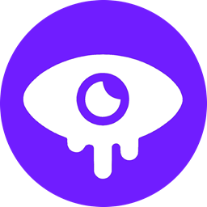

  
  <ul align="center" style="list-style: none">
    

      <h1>Botcord</h1>
       
      

        Unofficial and open-source Discord client  
        for bot/application accounts for Windows machines
      

    

  </ul>

## Features
- Browse joined servers
- View full channel list including hidden channels
- View contents of visible text channels
- Set account's presence status
- Save account credentials
- Account switcher

> [!NOTE]
> Botcord is still in active development and lacks many essential features. These will be added over next months of development.

## Installing
- Download the latest standalone executable from [releases](https://github.com/muffoi/Botcord/releases) and run it anywhere you desire.
- Or, download the zip distributable, extract it and run the main executable in directory (the one with app icon).

> [!IMPORTANT]
> If you get a warning that the app cannot be opened, click "Run Anyways". You may need to click "more info" to see this option.
> This warning is entirely harmless and only shows because the app is not signed. Signing it would cost me [upwards of 300€/year](https://shop.certum.eu/data-security/code-signing-certificates/certum-ev-code-sigining.html).

## Disclaimer

Discord is trademark of Discord Inc. and solely mentioned for the sake of descriptivity.
Mention of it does not imply any affiliation with or endorsement by Discord Inc.

The Botcord developers take no responsibility for the actions executed through Botcord.
